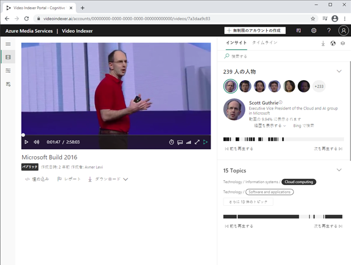
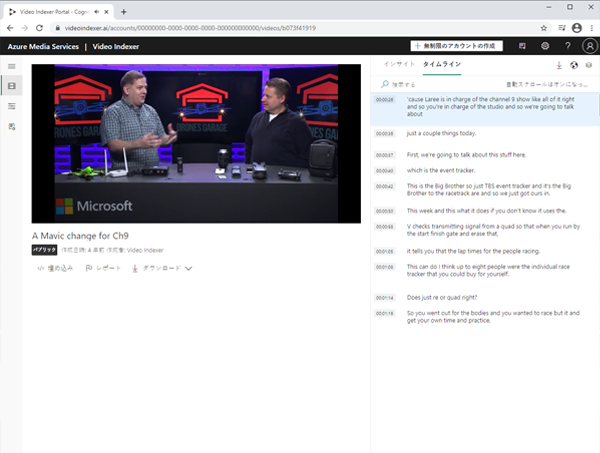
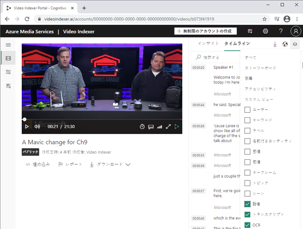
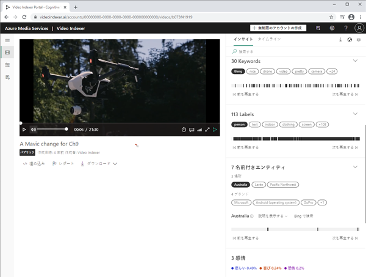
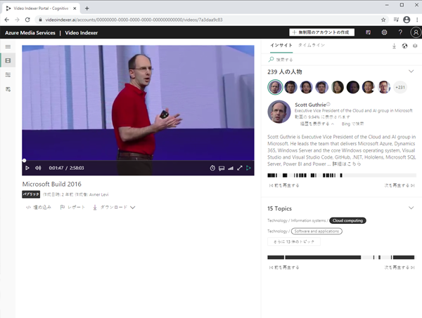
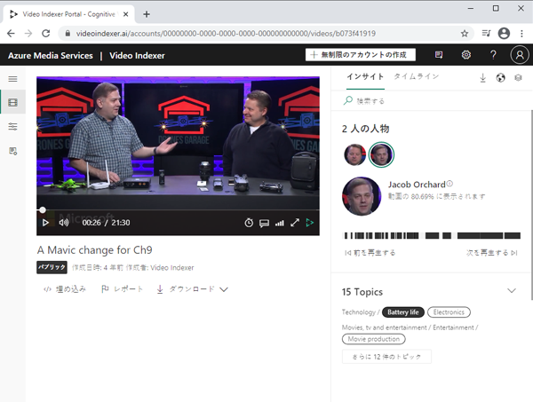
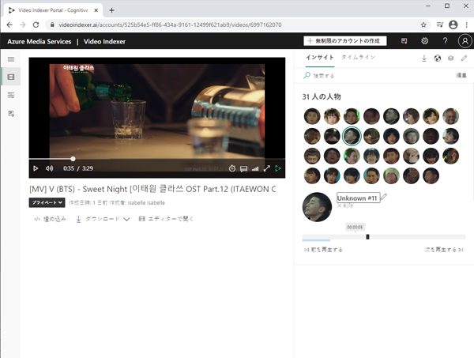
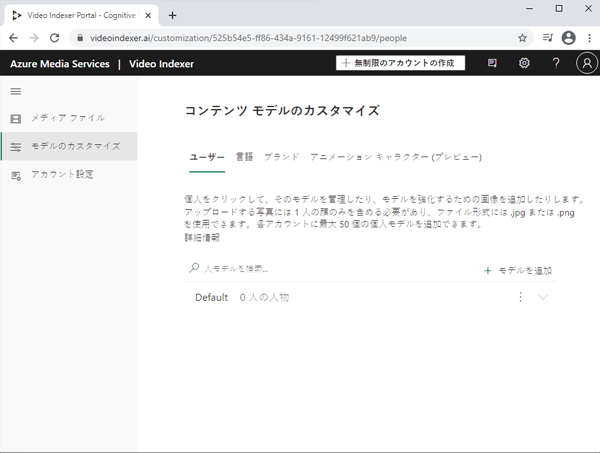
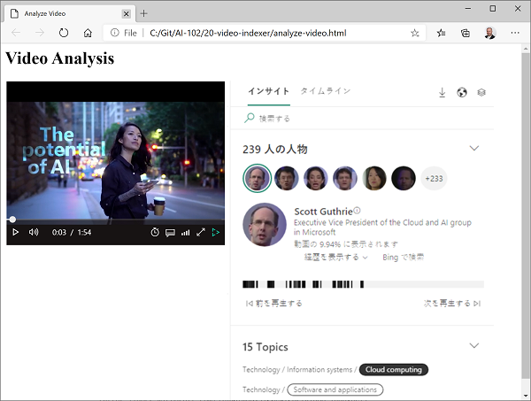

---
lab:
    title: 'Video Indexer を使用する動画の分析'
    module: 'モジュール 8 - Computer Vision の概要'
---

# Video Indexer を使用する動画の分析

今日作成および消費されているデータの大部分は動画形式です。**Video Indexer** は、AI を利用したサービスであり、動画のインデックスを作成し、そこからインサイトを抽出するために使用できます。

## このコースのリポジトリを複製する

**AI-102-AIEngineer** コード リポジトリをこのラボで作業している環境に既に複製している場合は、Visual Studio Code で開きます。それ以外の場合は、次の手順に従って今すぐ複製してください。

1. Visual Studio Code を起動します。
2. パレットを開き (SHIFT+CTRL+P)、**Git: Clone** コマンドを実行して、 `https://github.com/MicrosoftLearning/AI-102-AIEngineer` リポジトリをローカル フォルダーに複製します (どのフォルダーでもかまいません)。
3. リポジトリを複製したら、Visual Studio Code でフォルダーを開きます。
4. リポジトリ内の C# コード プロジェクトをサポートするために追加のファイルがインストールされるまで待ちます。

    > **注**: ビルドとデバッグに必要なアセットを追加するように求められた場合は、**「今はしない」** を選択します。

## 動画を Video Indexer にアップロードする

最初に、Video Indexer ポータルにサインインして、動画をアップロードする必要があります。

> **ヒント**: ホストされているラボ環境で Video Indexer ページの読み込みが遅い場合は、ローカルにインストールされているブラウザーを使用してください。後のタスクのために、ホストされている VM に戻すことができます。

1. ブラウザで、`https://www.videoindexer.ai` にある Video Indexer ポータルを開きます。
2. 既存の Video Indexer アカウントをお持ちの場合は、サインインします。それ以外の場合は、無料のアカウントにサインアップし、Microsoft アカウント (またはその他の有効なアカウント タイプ) を使用してサインインします。サインインに問題がある場合は、プライベート ブラウザー セッションを開いてみてください。
3. Video Indexer で、**「アップロード」** オプションを選択します。次に、**ファイル URL を入力する**オプションを選択し、`https://aka.ms/responsible-ai-video`と入力します。デフォルト名を **Responsible AI** に変更し、既定の設定を確認し、チェックボックスを選択して顔認識に関する Microsoft のポリシーに準拠していることを確認し、ファイルをアップロードします。
4. ファイルがアップロードされたら、Video Indexer が自動的にインデックスを作成するまで数分待ちます。

> **注**: この演習では、この動画を使用して Video Indexer の機能を調べます。ただし、A I対応アプリケーションを責任を持って開発するための有用な情報とガイダンスが含まれているため、演習が終了したら、時間をかけて完全に確認する必要があります。 

## ビデオ インサイトの確認

インデックス作成プロセスは、ポータルで表示できる動画からインサイトを抽出します。

1. Video Indexer ポータルで、動画にインデックスが付けられたら、それを選択して表示します。動画から抽出されたインサイトを示すペインの横にビデオ プレーヤーが表示されます。

2. 動画の再生中に、**「タイムライン」** タブを選択して、動画オーディオのトランスクリプトを表示します。

3. ポータルの右上にある **「表示」** 記号 (&#128455; に似ています) を選択し、インサイトのリストで、**「トランスクリプト」** に加えて、**「OCR」** と **「スピーカー」** を選択します。

4. **「タイムライン」** ペインに次のものが含まれていることを確認します。
    - 音声ナレーションのトランスクリプト。
    - 動画に表示されるテキスト。
    - 動画に登場するスピーカーの表示。よく知られている人の中には、名前で自動的に認識される人もいれば、番号で示される人もいます (たとえば、*スピーカー #1*)。
5. **「インサイト」** ペインに戻り、そこに表示されるインサイトを表示します。これには次のようなものがあります。
    - ビデオに表示される個々の人。
    - ビデオで議論されたトピック。
    - ビデオに表示されるオブジェクトのラベル。
    - ビデオに表示される人物やブランドなどの名前付きエンティティ。
    - キー シーン。
6. **「インサイト」** ペインが表示されている状態で、**「ビュー」** 記号を再度選択し、インサイトのリストで **「キーワード」** と **「感情」** をペインに追加します。

    見つかったインサイトは、動画の主なテーマを決定するのに役立ちます。たとえば、この動画の**トピック**は、テクノロジー、社会的責任、および倫理に関するものであることを明確に示しています。

## インサイトを検索する

Video Indexerを使用して、動画でインサイトを検索できます。

1. **「インサイト」** ペインの **「検索」** ボックスに、「*Bee*」と入力します。すべてのタイプのインサイトの結果を表示するには、「インサイト」 ペインを下にスクロールする必要がある場合があります。
2. 下に示されている動画の場所で、一致する*ラベル*が 1 つ見つかったことを確認します。
3. ミツバチの存在が示されているセクションの先頭を選択し、その時点で動画を表示します (動画を一時停止して慎重に選択する必要がある場合があります。ミツバチは短時間しか表示されません。)
4. 動画のすべてのインサイトを表示するには、**「検索」** ボックスをクリアします。

## インサイトを編集する

Video Indexer を使用して、見つかったインサイトを編集し、カスタム情報を追加して、動画をさらに理解することができます。

1. 動画を最初に巻き戻して、**「インサイト」** ペインの上部にリストされている**人**を表示します。コンピューター科学者でマイクロソフトのテクニカルフェローである **Eric Horwitz** を含め、一部の人々が認識されていることを確認してください。

2. Eric Horwitz の写真を選択し、その下の情報を表示します。**「経歴の表示」** セクションを展開して、この人物に関する情報を表示します。
3. この人物が登場する動画内の場所が示されていることを確認してください。これらを使用して、動画のこれらのセクションを表示できます。
4. ビデオ プレーヤーで、0:34 頃に話している人を見つけます。

5. この人物が認識されておらず、**Unknown #1** などの一般的な名前が割り当てられていることを確認します。ただし、動画にはこの人物の名前のキャプションが含まれているため、この人物の詳細を編集することでインサイトを深めることができます。
6. ポータルの右上にある **「編集」** アイコン (&#x1F589;) を選択します。次に、不明な人物の名前を **Natasha Crampton** に変更します。

7. 名前を変更したら、**「インサイト」** ペインで *Natasha* を検索します。結果には 1 人の人物が含まれ、それらが表示される動画のセクションが示されている必要があります。
8. ポータルの左上にあるメニュー (&#8801;) を展開し、**「モデルのカスタマイズ」** ページを選択します。次に、**「人」** タブで、**「既定の」** 人モデルに 1 人の人が含まれていることを確認します。Video Indexer は、名前を付けた人物を人物モデルに追加しました。これにより、アカウントでインデックスを作成する今後の動画でその人物が認識されるようになります。

既定の人物モデルに、画像を追加したり、独自の新しいモデルを追加したりできます。これにより、顔の画像を使用して人のコレクションを定義し、Video Indexer が動画内でそれらを認識できるようにすることができます。

また、言語 (たとえば、Video Indexer に認識させたい業界固有の用語を指定するため) およびブランド (たとえば、会社名や製品名) のカスタム モデルを作成できることにも注意してください。

## Video Indexer ウィジェットを使用する

Video Indexer サーポータルは、動画インデックス プロジェクトを管理するための便利なインターフェイスです。ただし、Video Indexer アカウントにアクセスできないユーザーが動画とそのインサイトを利用できるようにしたい場合があります。Video Indexer は、この目的のために Web ページに埋め込むことができるウィジェットを提供します。

1. Visual Studio Code の **16-video-indexer** フォルダーで、**analyze-video.html** を開きます。これは、Video Indexer の **「プレーヤー」** ウィジェットと **「インサイト」** ウィジェットを追加する基本的な HTML ページです。ヘッダー内の **vb.widgets.mediator.js** スクリプトへの参照に注意してください。このスクリプトにより、ページ上の複数の Video Indexer ウィジェットが相互に対話できるようになります。
2. Video Indexer ポータルで、**「メディア ファイル」** ページに戻り、**責任ある AI** 動画を開きます。
3. ビデオ プレーヤーの下の **「&lt;/&gt;埋め込み」** を選択し、HTML iframe コードを表示して、ウィジェットを埋め込みます。
4. **「共有と埋め込み」** ダイアログ ボックスで、**「プレーヤー」** ウィジェットを選択し、動画サイズを 560 x 315 に設定してから、埋め込みコードをクリップボードにコピーします。
5. Visual Studio Code の **analyze-video.html** ファイルで、コピーしたコードをコメント「**&lt;-- Player widget goes here -- &gt;**」の下に貼り付けます。
6. **「共有と埋め込み」** ダイアログボックスに戻り、**「インサイト」** ウィジェットを選択して、埋め込みコードをクリップボードにコピーします。次に、**「共有と埋め込み」** ダイアログボックスを閉じ、Visual Studio Code に戻って、コピーしたコードをコメント「**&lt;-- Insights widget goes here -- &gt;**」の下に貼り付けます。
7. ファイルを保存します。次に、**「エクスプローラー」** ペインで、**analyze-video.html** を右クリックし、**「ファイルエクスプローラーで表示」** を選択します。
8. ブラウザーのファイル エクスプローラーで、**analyze-video.html** を開き、Web ページを表示します。
9. **「インサイト」** ウィジェットを使用してウィジェットを試して、「insights」を検索し、動画内でそれらにジャンプします。

## Video Indexer REST API を使用する

Video Indexer は、アカウントに動画をアップロードおよび管理するために使用できる REST API を提供します。

### API の詳細を取得する

Video Indexer APIを使用するには、リクエストを認証するための情報が必要です。

1. Video Indexer ポータルで、メニュー (≡) を展開し、**「アカウント設定」** ページを選択します。
2. このページの**アカウント ID** に注意してください。後で必要になります。
3. 新しいブラウザー タブを開き、Video Indexer 開発者ポータル (`https://api-portal.videoindexer.ai`) に移動し、Video Indexer アカウントの資格情報を使用してサインインします。
4. **「製品」** ページで、**「承認」** を選択します。
5. Authorization API のサブスクリプションを既にお持ちの場合は、それを選択します。それ以外の場合は、新しいサブスクリプションを作成します。
6. サブスクリプションのあるページで、サブスクリプションごとに 2 つのキー (プライマリとセカンダリ) が割り当てられていることを確認します。次に、いずれかのキーの **「表示」** を選択して表示します。このキーはまもなく必要になります。

### REST API の使用

アカウント ID と API キーを取得したので、REST API を使用してアカウント内の動画を操作できます。この手順では、PowerShell スクリプトを使用して REST 呼び出しを行います。ただし、cURL や Postman などの HTTP ユーティリティ、または JSON over HTTP を送受信できるプログラミング言語にも同じ原則が適用されます。

Video Indexer REST API とのすべての対話は、同じパターンに従います。

- ヘッダーに API キーを含 む **AccessToken** メソッドへの最初のリクエストは、アクセス トークンを取得するために使用されます。
- 後続のリクエストは、REST メソッドを呼び出して動画を操作するときに、アクセス トークンを使用して認証します。

1. Visual Studio Code の **16-video-indexer** フォルダーで、**get-videos.ps1** を開きます。
2. PowerShell スクリプトで、**YOUR_ACCOUNT_ID** および **YOUR_API_KEY** プレースホルダーを、以前に識別したアカウント ID および API キーの値に置き換えます。
3. 無料アカウントの*場所*が「試用版」であることに注意してください。無制限の Video Indexer アカウント (関連付けられた Azure リソースを含む) を作成した場合は、これを Azure リソースがプロビジョニングされている場所 (「eastus」など) に変更できます。
4. スクリプトのコードを確認し、2 つの REST メソッドを呼び出すことに注意してください。1 つはアクセス トークンを取得するためのもので、もう 1 つはアカウント内の動画を一覧表示するためのものです。
5. 変更を保存してから、「スクリプト」 ペインの右上で、**「&#9655;」** ボタンを使用して、スクリプトを実行します。
6. REST サービスからの JSON 応答を表示します。これには、以前にインデックスを作成した**責任のある AI** 動画の詳細が含まれている必要があります。

## 詳細情報

**Video Indexer** の詳細については、[Video Indexer のドキュメント](https://docs.microsoft.com/azure/media-services/video-indexer/)を参照してください。
